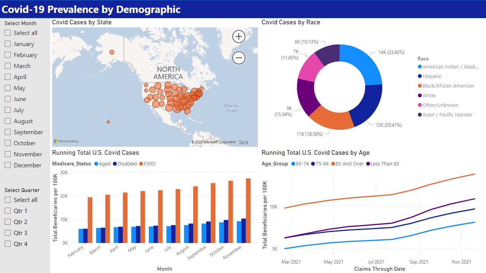

# PowerBI_Covid_Prevalence

I did this project for practice using PowerBI. The data is from the CDC and is publicly available for download at https://data.cms.gov/covid-19/medicare-covid-19-cases-hospitalizations.
The notebook includes some light data cleaning and feature extraction from the original dataset.
